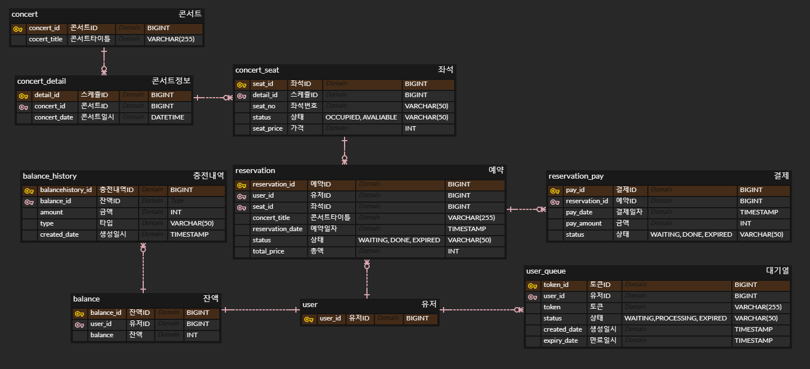

# 콘서트 예약 서비스

# 동시성 제어

## 문제 상황

### 1. 예약 요청

- 여러 사용자가 같은 콘서트, 같은 날짜, 같은 좌석에 예약을 동시에 요청

### 2. 잔액 충전 요청

- 한 명의 유저가 잔액 충전 요청 시, 중복 호출(따닥)이 되는 경우

## 해결 방법

### 비관적 락(DB락)

DB 수준에서 제공하는 locking 기법으로, 한 트랜잭션이 끝날 때까지 다른 트랜잭션이 대상 데이터에 접근하지 못하게 한다.

이때 접근하는 다른 트랜잭션은 해당 데이터의 작업중인 트랜잭션의 락이 해제 될 때까지 대기해야 한다.

- 장점: 충돌이 발생할 가능성을 원천 차단하여 데이터의 일관성을 보장한다.
- 단점: 한 트랜잭션이 진행되는 동안 데이터에 대한 접근이 차단되기 때문에 성능저하 및 데드락이 발생 할 수 있다.

### 낙관적 락

Application 수준에서 제공하는 locking기법으로, 데이터베이스를 잠그는 것이 아니기 때문에 트랜잭션이 진행되는 동안 다른 트랜잭션이 접근 할 수 있다.

버전 관리 컬럼(@Version 등)으로 트랜잭션이 시작할 때와 끝날 때의 데이터 상태를 비교하여 충돌이 발생했을 때 트랜잭션을 롤백한다.

- 장점: 다른 트랜잭션이 대기할 필요가 없고 별도의 락을 사용하지 않으므로 성능적으로 우수하다.
- 단점: 충돌 발생 시 비즈니스 로직이 처음부터 재실행 되기 때문에 충돌이 잦은 상황에서는 처리비용이 더 클 가능성이 있다.

### 분산락

여러 노드나 서버 간(분산환경)에서 공유되는 데이터의 동시성을 관리하는데 사용한다.

여러 서버에서 동시에 같은 자원에 접근 시 한번에 하나의 서버만 자원에 접근하도록 제한해주므로멀티 인스턴스 환경에서도 공통된 락을 사용 할 수 있다.

- 장점: 디스크 기반 데이터베이스(MySQL 등)보다 성능적으로 빠르다.
- 단점: locking 중 네트워크 통신이 필요하므로 지연이 발생 할 수 있으며 네트워크 분할로 인해 노트 간 통신이 불가능한 경우 일관성 문제가 발생 할 수 있다.

## 적용

### 1. 예약 요청 - 낙관적 락(차악)

- 긴 트랜잭션: 예약 정보를 꾸리기 위해 많은 테이블을 참조 해야함
    - 비관적 락: 트랜잭션이 길어지는 만큼 다른 트랜잭션의 대기시간이 길어지므로 성능 저하 및 교착상태에 빠질 위험이 커짐
    - 분산락: 트랜잭션이 여러 자원을 락할 시 교착상태 가능성이 높아지며 타임아웃 설정이 까다로워 트랜잭션이 중간에 실패할 수 있음
- 많은 경합: 보통 콘서트는 티켓팅이 시작되자마자 짧은 시간 안에 많은 트래픽이 몰림
    - 비관적 락: 대기하는 트랜잭션이 늘어나게 되어 교착상태에 빠질 가능성 증가시킴
    - 분산락: 높은 트래픽 상황에서 네트워크 지연으로 인한 성능 저하 가능성 있음

### 2. 잔액 충전 요청 - 낙관적 락(최선)

- 적은 충돌:  잔액 충전이 동시 호출 되는 경우는 빈번하지 않을 것이라 상정
    - 낙관적 락: 충돌이 적은 상황에서 트랜잭션을 즉시 커밋시켜 처리 속도 향상시킴
- 한정적 시간: 좌석이 임시 배정 된 동안 잔액이 부족 할 경우 임시 배정이 만료되기 전까지 충전 후 결제를 진행해야 함
    - 낙관적 락: 충돌이 발생하더라도 자동 재시도 메커니즘이 빠르고 응답 지연이 길지 않음

## 결과

### 낙관적 락

- 충전

- 예약

### 비관적 락

- 충전

- 예약

## step05

Milestone

## [바로가기](https://github.com/users/xxyoonxx/projects/2)

요구사항 명세서

[대기열 API]
- 토큰 발급: 유저의 UUID, 대기순서, 잔여시간을 포함한 토큰 발급
- 대기열 검증: 유효한 대기열인지 검증
- 대기번호 조회: 현재 대기순서를 조회
- 대기열 만료: 좌석 배정 완료, 전 좌석 매진, 임시 배정 시간 초과 시 토큰을 만료시킴

[콘서트 좌석 조회 API]
- 콘서트 조회: 진행되는 콘서트 조회
- 날짜 조회: 특정 콘서트의 예약 가능 날짜 조회
- 좌석 조회: 특정 콘서트, 특정 날짜의 좌석 정보 조회

[좌석 예약 API]
- 예약 요청: 콘서트, 좌석번호, 날짜 정보로 예약 요청
- 좌석 임시 배정: 예약 요청 성공시 최종 배정 전까지 5분간 좌석 임시 배정
- 좌석 최종 배정: 임시 배정 시간 내 결제 완료시 좌석 최종 배정

[잔액 충전/조회 API]
- 잔액 충전: 유저 정보와 충전금액을 받아 잔액 충전
- 잔액 조회: 유저 정보로 잔액 조회

[결제 API]
- 결제 생성: 좌석 임시 배정 시 결제 정보 생성하여 반환
- 결제 처리: 사용자의 잔액으로 결제를 요청하고 처리
- 결제 내역 조회: 결제 완료 된 내역 조회

시퀀스 다이어그램

## step06

ERD 설계

API 명세서

## [원본 링크](https://fancy-act-7c0.notion.site/ef679d726eb54065a7fac47add8d0b30?v=c041866b5a224b788f056cdd8caf4ceb&pvs=4)

Mock API

- /queue POST 대기열 요청

- /queue/status GET 대기열 확인

- /concerts [GET 콘서트 목록 조회](https://4d27ed9a-e6d8-40be-beb9-c3124be0a8ff.mock.pstmn.io/concerts)

- /concerts/{concertId}/dates [GET 예약 가능 날짜 조회](https://4d27ed9a-e6d8-40be-beb9-c3124be0a8ff.mock.pstmn.io/concerts/1/dates)

- /concerts/{concertId}/dates/{detailId}/seats [GET 예약 가능 좌석 조회](https://4d27ed9a-e6d8-40be-beb9-c3124be0a8ff.mock.pstmn.io/concerts/1/dates/2/seats)

- /reservation POST 좌석 예약 요청

- /payment/{userId}/balance [GET 잔액 조회](https://4d27ed9a-e6d8-40be-beb9-c3124be0a8ff.mock.pstmn.io/user/1/balance)

- /payment/{userId}/charge PATCH 잔액 충전

- /payment POST 결제

Swagger UI

